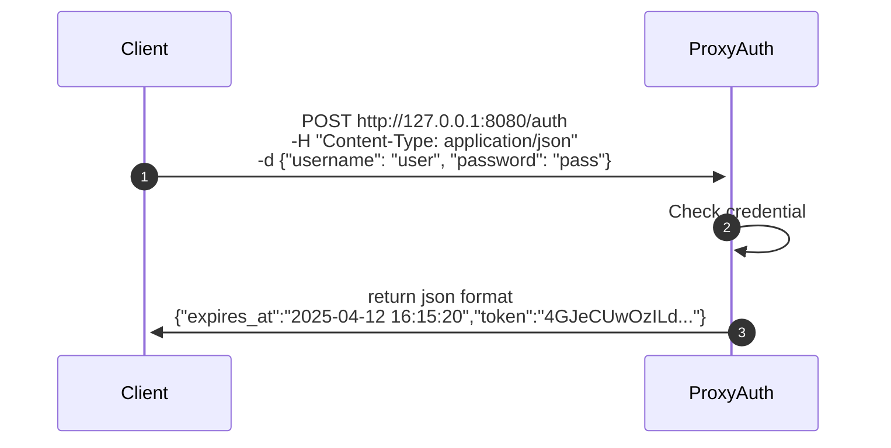
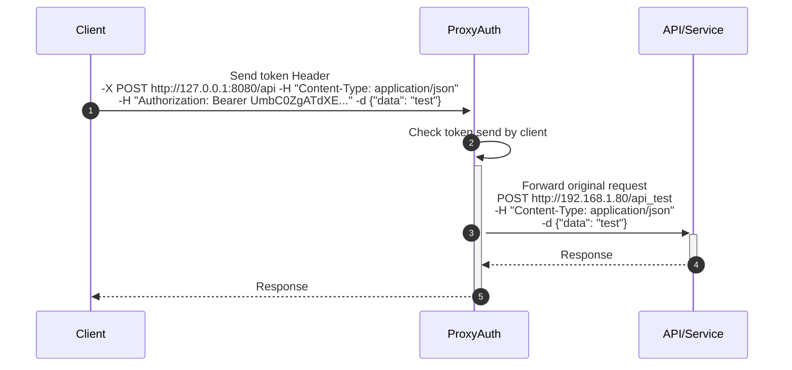
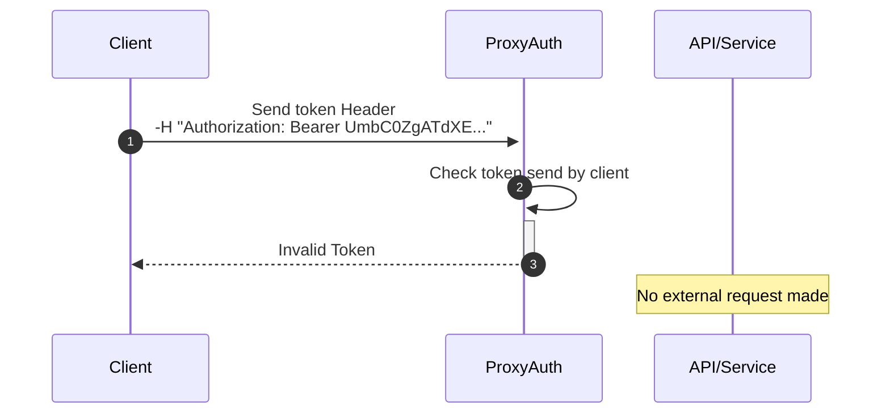

<div align="center">
<h1>ProxyAuth (Community Edition)</h1>
<br>

</div>
<br>


[](https://github.com/vBlackOut/ProxyAuth/actions/workflows/proxyauth.yml)


[](https://crates.io/crates/proxyauth)

[](https://discord.gg/sKPRWzYdCy)


💣 ProxyAuth is now a universal reverse proxy system, capable of handling authentication and access control for any backend application or dashboard.

ProxyAuth secures backend APIs/Dashboard through a fast authentication gateway.
It encrypts tokens using ChaCha20 + HMAC-BLAKE3, with config-defined secrets.
It features built-in rate limiting (on proxy and auth routes) and uses Argon2 with auto-generated salts for secure password hashing.
The service is extremely fast, handling ~ 180,000+ requests per second under load.  

## Documentation
<a href="http://proxyauth.app">Views the documentation</a>  
<b>Possible to contribute the documentation: <a href="https://github.com/vBlackOut/ProxyAuth-Docs">ProxyAuth Docs</a> </b> :heart:

## Auto Salt config.json password for argon2
Please enter your password in config.json. The application will automatically generate the Argon2 salt on first startup and rewrite the file with the hashed password.

## Rate Limiting
- Implements rate limiting per user rather than per token.
This means that if someone generates 150 tokens and uses them simultaneously, the rate limit will still apply to the user, not to each token separately, unlike traditional systems.
This mechanism applies to all routes managed by ProxyAuth.
- Adds rate limiting to the /auth route to help protect against brute-force attacks and excessive request traffic.
The rate limiting behavior—such as request limits, configurable via the config.json file.
This allows for dynamic adjustments without needing to modify the application code.
The implementation uses a middleware layer that evaluates each incoming request to /auth and applies the configured limits accordingly.

## ProxyAuth Usage

Configuration file

<details>
<summary>routes.yml configuration file:</summary>

```
routes:
  - prefix: "/redoc"
    target: "http://127.0.0.1:8000/redoc"
    secure: false

  - prefix: "/api_test/openapi.json"
    target: "http://localhost:8000/api_test/openapi.json"
    secure: false

  - prefix: "/api_test"
    target: "http://localhost:8000/api_test"
    username: ["admin", "alice1", "alice15", "alice30"]
    proxy: true/false # --> configure proxy
    proxy_config: "http://myproxyurl:8888" # --> pass via proxy for call the target.
    cert: {"file": "certificat.pk12", "password": "1234"} # /!\ this fonctionnality is experimental untested version 0.5.0 /!\
```
</details>

<details>
<summary>config.yml configuration file:</summary>

```
{
  "token_expiry_seconds": 3600,
  "secret": "supersecretvalue",
  "host": "127.0.0.1",
  "port": 8080,
  log: {"type": "local"}, --> use for loki {"type": "loki", "host": "http://host_loki:port"}
  "ratelimit_proxy": {
    "burst": 100,
    "block_delay": 500,
    "requests_per_second": 10
  },
  "ratelimit_auth": {
    "burst": 10,
    "block_delay": 500,
    "requests_per_second": 10
  },
  "worker": 4,
  "users": [
    { "username": "admin", "password": "admin123" },
    { "username": "bob", "password": "bobpass" },
    { "username": "alice1", "password": "alicepass" }
  ]
}
```
</details>

<details>
<summary>Install on the server</summary>

```
curl -fsSL https://proxyauth.app/sh/install | bash
```
</details>
<details>
<summary>Uninstall on the server</summary>

```
curl -fsSL https://proxyauth.app/sh/uninstall | bash
```
</details>

<details>
<summary>Easy launch ProxyAuth</summary>

```
sudo systemd start proxyauth
```
</details>

<details>
  <summary>Use on docker</summary>

  ```
  docker compose build
  docker compose up -d
  ```
</details>

<details>
  <summary>Use this services easy on docker</summary>

  <br>Change configuration on docker-compose.yml overwrite configuration

  ```
  volumes:
    - ./config/config.json:/app/config/config.json
    - ./config/routes.yml:/app/config/routes.yml
  ```

restart container
```
docker compose restart
```

</details>

## TODO
- Log to stdout using `tracing` (Rust log lib) [still being deployed]
- ~Protect passwords config.json using Argon2.~ [Done v0.4.0]
- ~Add Loki integration with tracing [needs further exploration]~ [Done >=0.5.2]
- ~Add revoke token method.~ Bonus: multi-cluster via redis [Done v0.8.3]

# ProxyAuth Advantages
- Centralized access point
- Secure tokens using CHACHA20 (HMAC BLAKE3 + ROTATE)
  just define the same secret across all instances to have the same token calculations (if use the same images).
- ~Semi-static tokens (refresh_token is only recalculated at intervals defined in the config)~
- Tokens can be recalculated using a random exponential factor, allowing for further complexity.
- Possible send logs via loki [>=0.5.2]  

# Potential Disadvantages
- If someone can reverse-engineer the hash, they could potentially access services.
  This is why you must define a secure secret (over 64 characters!) in the config.
  This method is used in Django for password hashing via PBKDF2:
  https://docs.djangoproject.com/en/5.1/ref/settings/#std-setting-SECRET_KEY


# Failover
<details>
<summary>Failover normal mode (click for open)</summary>

</details>

<details>
<summary>Failover over mode proxy (click for open)</summary>

</details>

## ProxyAuth Structure
The server behaves like an authentication proxy.

Refresh token route:


#### Scenario 1: Valid Token


#### Scenario 2: Invalid Token


This application allows applying global authentication tokens to any application, removing the need for them to implement token validation themselves, which simplifies future development.
