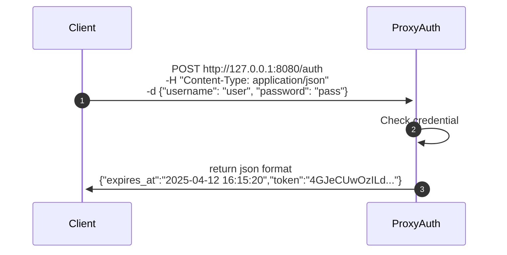
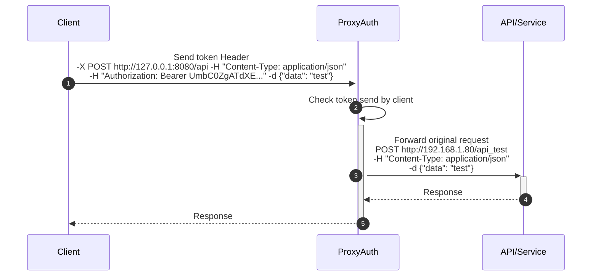
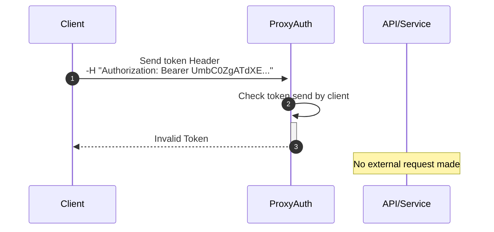

<div align="center">
<h1>ProxyAuth (Community Edition)</h1>
<br>

</div>
<br>


<a href="https://crates.io/crates/proxyauth">
  
</a>
<a href="https://crates.io/crates/proxyauth">
  
</a>


ProxyAuth is an application that secures backend APIs without requiring them to implement their own security mechanisms.
It acts as a gateway that ensures the secure transmission of internal information to the outside, encrypted with CHACHA20 (HMAC SHA-256 + ROTATE).
This allows generating a secure token, defined by a secret specified in the ProxyAuth configuration.

**Project based on a other personal project (evolution): <a href="https://github.com/vBlackOut/rust_actixweb_token">rust_actixweb_token</a>

## Security Mechanism
todo...

## Auto Salt config.json password for argon2
Please enter your password in config.json. The application will automatically generate the Argon2 salt on first startup and rewrite the file with the hashed password.

## Rate Limiting
- Implements rate limiting per user rather than per token.
This means that if someone generates 150 tokens and uses them simultaneously, the rate limit will still apply to the user, not to each token separately, unlike traditional systems.
This mechanism applies to all routes managed by ProxyAuth.
- Adds rate limiting to the /auth route to help protect against brute-force attacks and excessive request traffic.
The rate limiting behavior—such as request limits, configurable via the config.json file.
This allows for dynamic adjustments without needing to modify the application code.
The implementation uses a middleware layer that evaluates each incoming request to /auth and applies the configured limits accordingly.

## ProxyAuth Usage

Configuration file

<details>
<summary>routes.yml configuration file:</summary>

```
routes:
  - prefix: "/redoc"
    target: "http://127.0.0.1:8000/redoc"
    secure: false

  - prefix: "/api_test/openapi.json"
    target: "http://localhost:8000/api_test/openapi.json"
    secure: false

  - prefix: "/api_test"
    target: "http://localhost:8000/api_test"
    username: ["admin", "alice1", "alice15", "alice30"]
```
</details>

<details>
<summary>config.yml configuration file:</summary>

```
{
  "token_expiry_seconds": 3600,
  "secret": "supersecretvalue",
  "host": "127.0.0.1",
  "port": 8080,
  "ratelimit":{
         "requests_per_second": 5, --> Number requests per seconds for proxy call
         "burst": 10, --> burst allow requests
         "block_delay": 100, --> number block requests in milliseconds
         "auth": 5 --> number blocked authentifications user per seconds
},
  "worker": 4,
  "users": [
    { "username": "admin", "password": "admin123" },
    { "username": "bob", "password": "bobpass" },
    { "username": "alice1", "password": "alicepass" }
  ]
}
```
</details>

<details>
<summary>To compile the server</summary>

```
cargo build --release
```
</details>

<details>
<summary>To run the binary</summary>

```
./target/release/proxyauth
```

Post-compilation structure:
```
 --- app (parent directory)
  | --- proxyauth (binary)
  | --- config/
     |--- config.json (user/server configurations)
     |--- routes.yml (route configurations)
```
You can then copy the binary anywhere; it will work on any Linux architecture compatible with your current OS.
**You must create `config.json` and `routes.yml` at the root of the binary. See examples here: <a href="">config.json</a> and <a href="">routes.yml</a>

</details>

<details>
  <summary>Use on docker</summary>

  ```
  docker compose build
  docker compose up -d
  ```
</details>

<details>
  <summary>Use this services easy on docker</summary>

  <br>Change configuration on docker-compose.yml overwrite configuration

  ```
  volumes:
    - ./config/config.json:/app/config/config.json
    - ./config/routes.yml:/app/config/routes.yml
  ```

restart container
```
docker compose restart
```

</details>

## TODO
- Log to stdout using `tracing` (Rust log lib) [still being deployed]
- Protect passwords config.json using Argon2.
- Add Loki integration with tracing [needs further exploration]

# ProxyAuth Advantages
- Centralized access point
- Secure tokens using CHACHA20 (HMAC SHA-256 + ROTATE)
  just define the same secret across all instances to have the same token calculations (if use the same images).
- ~Semi-static tokens (refresh_token is only recalculated at intervals defined in the config)~
- Tokens can be recalculated using a random exponential factor, allowing for further complexity.

# Potential Disadvantages
- If someone can reverse-engineer the hash, they could potentially access services.
  This is why you must define a secure secret (over 64 characters!) in the config.
  This method is used in Django for password hashing via PBKDF2:
  https://docs.djangoproject.com/en/5.1/ref/settings/#std-setting-SECRET_KEY

## ProxyAuth Structure
The server behaves like an authentication proxy.

Refresh token route:

```mermaid
sequenceDiagram
    autonumber
    participant C as Client
    participant P as ProxyAuth

    C->>+P: POST http://127.0.0.1:8080/auth<br>-H "Content-Type: application/json"<br>-d {"username": "user", "password": "pass"}
    P->>+P: Check credential
    P->>+C: return json format <br>{"expires_at":"2025-04-12 16:15:20","token":"4GJeCUwOzILd..."}
```

#### Scenario 1: Valid Token

```mermaid
sequenceDiagram
    autonumber
    participant C as Client
    participant P as ProxyAuth
    participant A as API/Service

    C->>+P: Send token Header <br> -X POST http://127.0.0.1:8080/api -H "Content-Type: application/json" <br>-H "Authorization: Bearer UmbC0ZgATdXE..." -d {"data": "test"}
    P->>+P: Check token send by client
    P->>+A: Forward original request <br> POST http://192.168.1.80/api_test <br>-H "Content-Type: application/json" <br>-d {"data": "test"}
    A-->>-P: Response
    P-->>-C: Response
```

#### Scenario 2: Invalid Token

```mermaid
sequenceDiagram
    autonumber
    participant C as Client
    participant P as ProxyAuth
    participant E as API/Service

    C->>+P: Send token Header<br> -H "Authorization: Bearer UmbC0ZgATdXE..."
    P->>+P: Check token send by client
    P-->>-C: Invalid Token
    Note over E: No external request made
```

This application allows applying global authentication tokens to any application, removing the need for them to implement token validation themselves, which simplifies future development.

## Benchmark
todo...
